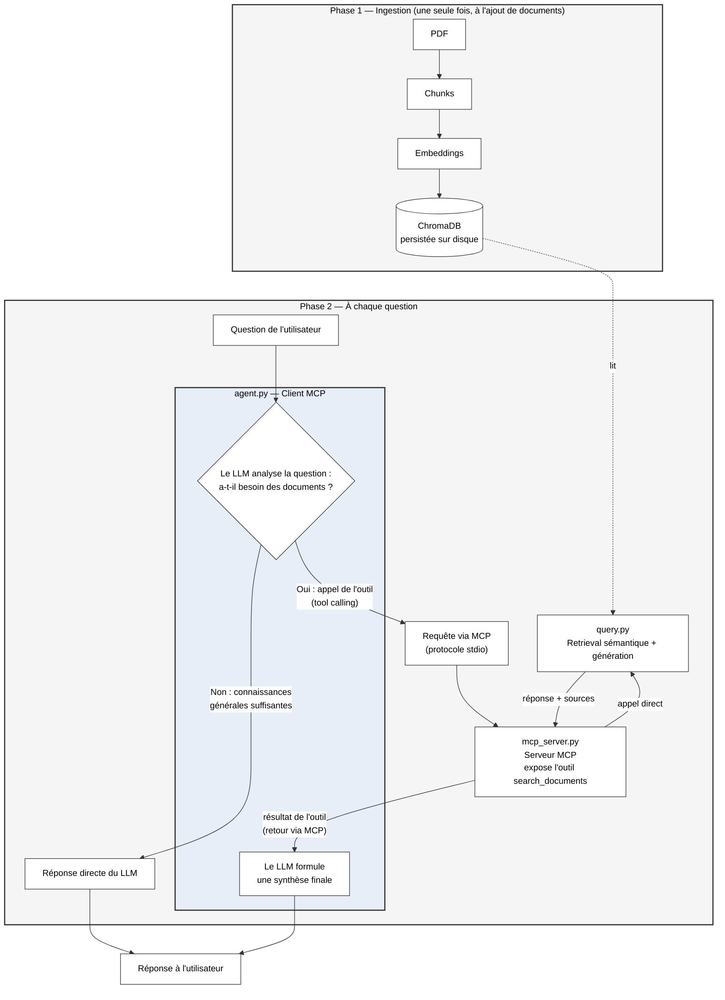
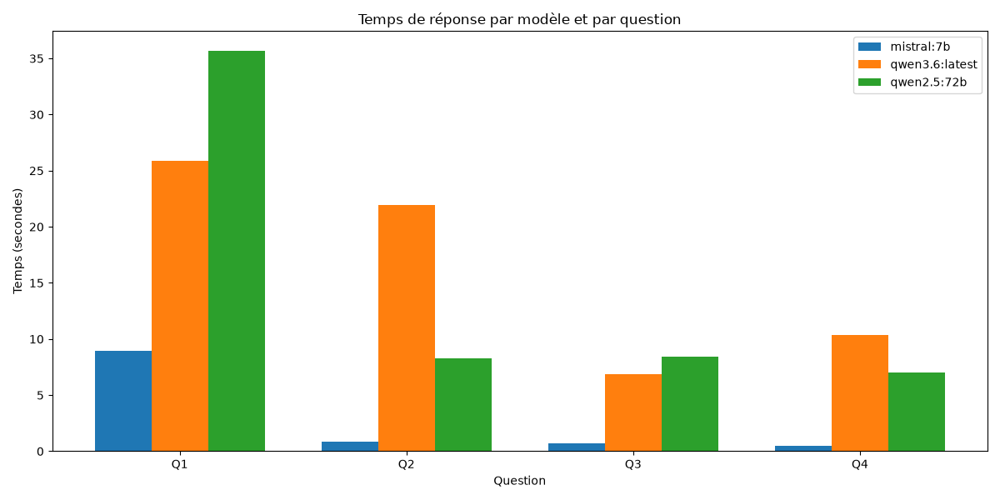
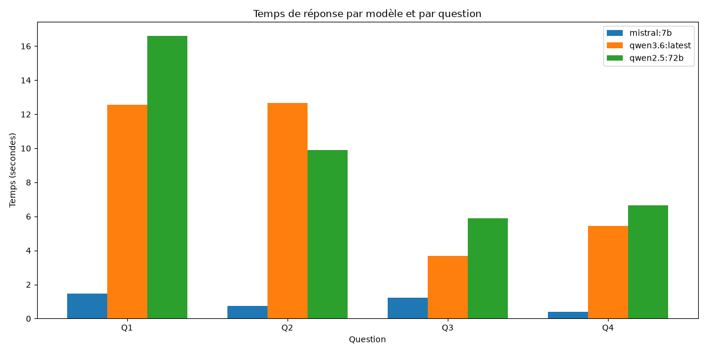

# RAG Research Copilot - RAG + MCP + Agent

Assistant de recherche documentaire basé sur un pipeline RAG (Retrieval-Augmented Generation), exposé comme outil via le Model Context Protocol (MCP), et interrogé par un agent capable de décider lui-même quand utiliser cet outil (tool calling).

Testé sur un corpus de papiers de recherche (*Attention Is All You Need*, *Co-Evolving Harnesses and Models: On-Policy Correction Helps Weaker Models Catch Up Where Imitation Fails*, et *Approximating the Statistics of a Gravitational Wave Background*), avec des modèles open source tournant en local sur un cluster de 4 GPU NVIDIA H100 via Ollama.

---

## Architecture



**Lecture du schéma :** l'ingestion (phase 1) ne se produit qu'une fois, à l'ajout de nouveaux documents : elle alimente la base ChromaDB. À chaque question posée (phase 2), c'est le LLM lui-même, dans `agent.py`, qui décide s'il doit interroger les documents via l'outil MCP (`mcp_server.py` → `query.py` → ChromaDB) ou s'il peut répondre directement avec ses connaissances générales, c'est ce comportement de décision autonome (tool calling) qui distingue cette architecture d'un simple pipeline RAG linéaire.

---

## Fonctionnalités

- Extraction et indexation de documents PDF (chunking + embeddings + base vectorielle persistée)
- Recherche sémantique (retrieval) avec affichage des sources (fichier + numéro de page)
- Génération de réponses ancrées dans les documents (pas dans la mémoire générale du LLM)
- Exposition du RAG comme outil MCP standardisé, testable indépendamment (`test_mcp_client.py`)
- Agent avec tool calling : le LLM décide lui-même d'utiliser l'outil ou de répondre directement, plutôt qu'un pipeline linéaire fixe
- Observabilité : mesure du temps de chaque étape (décision, appel outil, synthèse finale)

---

## Stack technique

| Outil | Rôle | Pourquoi ce choix |
|---|---|---|
| **Ollama** | Héberge les LLM et le modèle d'embeddings en local | Pas de coût API, exploite le cluster de 4 GPU H100 disponible |
| **LangChain** (community, text-splitters, chroma, ollama) | Chargement PDF, chunking, connecteurs | Écosystème standard |
| **ChromaDB** | Base de données vectorielle | Usage simple en local , persistance sur disque |
| **MCP (Model Context Protocol)** | Expose le RAG comme outil standardisé | Protocole déjà testé en stage |
| **mistral:7b** | Génération de réponse dans le RAG | Modèle léger|
| **qwen3.6** | Décision de l'agent (tool calling) | Support du tool calling plus stable que Mistral 7B sur les tests effectués |
| **qwen2.5:72b** | Comparaison dans le benchmark | Gros modèle (72B paramètres) permettant d'évaluer le compromis taille/latence sur l'infrastructure GPU disponible |

---

## Installation

### 1. Prérequis
- Python 3.11+ (le SDK MCP nécessite 3.10 minimum)
- [Ollama](https://ollama.com) installé et lancé

### 2. Corpus de test

Les documents utilisés pour les tests de ce projet, librement accessibles :
- *Attention Is All You Need* — https://arxiv.org/abs/1706.03762
- *Co-Evolving Harnesses and Models: On-Policy Correction Helps Weaker Models Catch Up Where Imitation Fails* — https://arxiv.org/abs/2609.09134
- *Approximating the Statistics of a Gravitational Wave Background* — https://arxiv.org/abs/2609.07686

(Les fichiers PDF ne sont pas inclus dans ce dépôt : à télécharger depuis les liens ci-dessus et à placer dans `data/pdfs/`.)

### 3. Modèles Ollama nécessaires

```bash
ollama pull mistral:7b
ollama pull qwen3.6
ollama pull nomic-embed-text
```

### 4. Environnement Python

```bash
python3.11 -m venv venv
source venv/bin/activate
pip install -r requirements.txt
```

### 5. Note sur SQLite

Sur certains systèmes, ChromaDB nécessite une version de SQLite plus récente que celle installée par défaut. Si l'erreur `Your system has an unsupported version of sqlite3` apparaît, un contournement est déjà en place en haut de `ingest.py`, `query.py` et `mcp_server.py` (remplacement du module `sqlite3` par `pysqlite3-binary`).

---

## Utilisation

### 1. Indexer des documents

Place des fichiers `.pdf` dans `data/pdfs/`, puis :

```bash
python src/ingest.py
```

Réinitialise automatiquement la base vectorielle à chaque exécution (évite les doublons).

### 2. Tester le RAG seul (sans MCP)

```bash
python src/query.py
```

### 3. Tester le serveur MCP isolément

```bash
python src/test_mcp_client.py
```

Vérifie que l'outil `search_documents` est bien exposé et fonctionnel via le protocole MCP.

### 4. Lancer l'agent complet (avec décision automatique)

```bash
python src/agent.py
```

### 5. Lancer le benchmark comparatif de modèles

```bash
python src/benchmark.py
```

Teste plusieurs modèles (`mistral:7b`, `qwen3.6:latest`, `qwen2.5:72b` par défaut, modifiables dans le script) sur un jeu de questions fixe. Génère un résumé en console, un fichier `benchmark_results.json` et un graphique `benchmark_chart.png`.

> Note : `answer_question()` (dans `query.py`) accepte un paramètre optionnel `model` (par défaut `mistral:7b`), ce qui permet au benchmark de tester plusieurs modèles sans dupliquer le code du pipeline RAG.

---

## Choix techniques et observations

### Problèmes rencontrés et résolus pendant le développement

- **Doublons à l'ingestion** : `Chroma.from_documents()` ajoute les données sans vérifier si elles existent déjà : chaque relance de `ingest.py` dupliquait les chunks (164 → 328 après une deuxième exécution). Résolu en réinitialisant la base (`shutil.rmtree`) avant chaque ingestion.
- **Incompatibilité SQLite** : la version système de SQLite était trop ancienne pour ChromaDB. Contournée via `pysqlite3-binary` avec substitution du module au runtime.
- **Rupture de version du SDK MCP** : la version 2.x du SDK a renommé `FastMCP` en `MCPServer` avec une API différente. Le projet reste sur `mcp<2` pour rester cohérent avec l'implémentation pratiquée en stage.
- **Fermeture de connexion MCP inattendue** : une erreur de portée (code placé en dehors du bloc `async with ClientSession(...)` après plusieurs itérations successives) provoquait une fermeture de session avant l'appel de l'outil. Corrigée en s'assurant que toute la logique dépendant de `session` reste dans le bon bloc `async with`.

### Instabilité du tool calling sur modèles locaux

Point d'observation le plus intéressant du projet : le comportement de décision de l'agent (appeler l'outil ou répondre directement) s'est révélé probabiliste, pas déterministe, y compris sur des questions clairement liées au corpus documentaire indexé.

Testé sur deux modèles :
- **mistral:7b** : dans certains cas, imite un appel d'outil sous forme de texte JSON brut plutôt que d'utiliser le mécanisme structuré de tool calling : `tool_calls` reste alors vide.
- **qwen3.6** : comportement plus fiable, mais toujours pas garanti à 100 % : sur plusieurs exécutions de la même question, le modèle a parfois répondu avec ses connaissances générales (halluginant une réponse plausible mais non sourcée) plutôt que d'interroger les documents.

Ce constat est cohérent avec les limites connues du tool calling sur des modèles de taille réduite tournant en local, par opposition à des modèles de plus grande taille (GPT-4, Claude) où ce comportement est généralement plus stable. Une option explorée mais non retenue par défaut : forcer l'appel de l'outil via `tool_choice`, ce qui garantirait un comportement stable au prix de la capacité de décision autonome : jugé moins cohérent avec l'objectif du projet (démontrer un vrai comportement agentique plutôt qu'un pipeline déguisé).

---

## Résultat capturé (exemple de session réussie)

**Question :** *Quels sont les avantages des transformers ?*

**Décision de l'agent :** appel de l'outil `search_documents` (tool call structuré, détecté par le LLM)

**Résultat de l'outil (RAG) :**
> Les Transformateurs permettent une parallélisation significativement plus importante et peuvent atteindre un nouveau niveau de qualité dans la traduction après avoir été entraînés pendant au moins douze heures sur huit GPU P100. Ils réduisent la computation séquentielle, ce qui permet aux signaux entre deux positions quelconques d'être traités plus efficacement, et ont pour objectif de rendre la génération moins séquentielle.
>
> Sources : `attention_is.pdf` — pages 9, 1, 8, 2

**Synthèse finale de l'agent :**
> Les modèles basés sur l'architecture des Transformers offrent plusieurs avantages majeurs par rapport aux architectures précédentes (comme les RNN ou LSTM) : parallélisation accrue, réduction de la computation séquentielle, mécanisme d'attention, polyvalence et extension à d'autres modalités (image, audio, vidéo), et performance supérieure sur des tâches comme la traduction automatique.

**Temps mesurés :**
| Étape | Durée |
|---|---|
| Décision du LLM | 15.1s (dont ~12s de chargement du modèle en mémoire GPU) |
| Appel de l'outil (RAG complet) | 10.4s |
| Synthèse finale | 2.7s |

---

## Benchmark comparatif de modèles

Comparaison de 3 modèles LLM open source sur le pipeline RAG complet (retrieval + génération), sur 4 questions couvrant les 3 documents indexés (transformers, coévolution, ondes gravitationnelles). Script : `src/benchmark.py`.

**Temps moyen par modèle (sur 2 exécutions séparées) :**

| Modèle | Run 1 (moyenne) | Run 2 (moyenne) |
|---|---|---|
| `mistral:7b` (7B paramètres, 4.7 Go) | 2,75s | 0,96s |
| `qwen3.6:latest` (23 Go) | 16,26s | 8,58s |
| `qwen2.5:72b` (72B paramètres, 47 Go) | 14,85s | 9,76s |

**Observations**

- **`mistral:7b` est systématiquement le plus rapide**, sur les deux exécutions et sur toutes les questions : cohérent avec sa taille nettement plus petite (7B vs 72B paramètres pour le plus gros modèle testé).
- **Effet de "cold start" observé sur les modèles plus gros** : la première question d'une session est presque toujours plus lente que les suivantes (jusqu'à 2-3x), le temps correspondant majoritairement au chargement du modèle en mémoire GPU plutôt qu'au calcul lui-même. Ce phénomène disparaît si le modèle était déjà chargé depuis un appel précédent.
- **Variance significative entre les deux exécutions** pour les modèles Qwen (ex : `qwen3.6` passe de ~16s à ~8,5s de moyenne d'un run à l'autre) : la performance mesurée dépend fortement de l'état du cache GPU au moment du lancement, pas uniquement du modèle. Ce constat rejoint l'observation faite plus haut sur l'instabilité du comportement des modèles locaux via Ollama, et illustre l'intérêt de mesurer plusieurs exécutions plutôt qu'un seul run pour tirer des conclusions fiables.
- **Aucune erreur sur les 24 appels effectués** (12 par run) le pipeline RAG reste stable quel que soit le modèle de génération utilisé.

**Graphiques des deux exécutions :**





Résultats bruts sauvegardés automatiquement au format JSON (`benchmark_results.json`) et graphique généré avec Matplotlib (`benchmark_chart.png`) à chaque exécution du script : le script écrase ces fichiers à chaque run, les deux images ci-dessus ont été conservées séparément pour comparer les deux exécutions.

